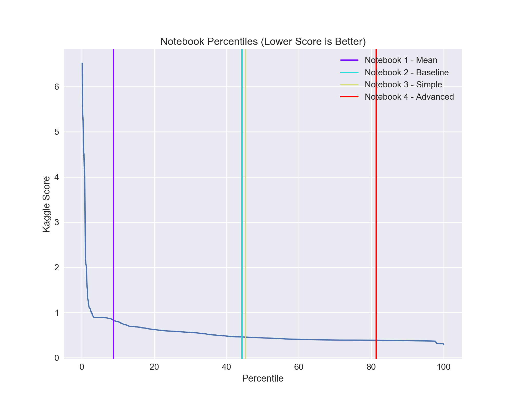

# NYC-Taxi-Demo
##### [Installation](#installation) | [Results](#results) | [FAQ](#faq)

[Featuretools](https://www.featuretools.com/) is a framework to perform automated feature engineering. It excels at transforming transactional and relational datasets into feature matrices for machine learning. This demo uses Featuretools to develop a prediction model for the New York City Taxi Trip Duration on [Kaggle](https://www.kaggle.com/c/nyc-taxi-trip-duration/overview).


##### What can I do?

Normally, solving Kaggle problems is a very iterative process. Competitors look at the dataset, determine what features they can extract, and score it with their model. They use that accuracy to make more changes to their feature extraction, and again score their model. <b>Featuretools simplifies to process to let you extract numerous features in one iteration. </b>

<center></center>

## Installation

To use run these notebooks, do the following
#### Mac OS
```sh
brew install gcc@5 --without-multilib
pip install -r requirements.txt
```
#### Linux
```sh
sudo apt-get install build-essential
pip install -r requirements.txt

```

You will also need these datasets.
The dataset for notebooks 1, 2, and 3 dataset is found <a href=https://www.kaggle.com/c/nyc-taxi-trip-duration/data>here</a>.

1. train.csv
2. test.csv

Using Notebook 4 will require additional datasets <a href=https://www.kaggle.com/oscarleo/new-york-city-taxi-with-osrm> here</a> and <a href=https://www.kaggle.com/somesnm/new-york-parties-eda/output>here</a>.</p>

1. fastest\_routes\_test.csv
2. fastest\_routes\_train\_part_1.csv
3. fastest\_routes\_train\_part_2.csv


## Results

1. We can see that using Featuretools allows us to acheive better results. Featuretools is used in notebook 3 and notebook 4, both of which score in a higher percentile than the baseline score.

<center>

</center>


2. Comparing the Kaggle Scores for the notebooks also shows the better results acheived. The leaderboard score for the most advanced notebook is very close to the best score.

<center>

</center>

## FAQ

#### Q: Why remove the outliers in the train data?

Trips that are outside of the 99th quantile for trip length will unduly skew all of our numbers and results. Let's remove them. This will remove only 14593 out of the nearly 1.5 million trips from the train dataset.

Some of the trips might have a high extremely trip duration.
When we check those points, some of the passengers are traveling into the Atlantic ocean. Not only are these points outliers, they also probably don’t correspond to real travel information. By cutting out extremal values, we can train a regressor that is a better fit for most values.

#### Q: Why is `dropoff_datetime` present in the train data but not in the test data?

According to the Kaggle website:
> The decision was made to not remove dropoff coordinates from the dataset order to provide an expanded set of variables to use in Kernels.

Since the `dropoff_datetime` was not present in the test dataset, we removed it. It also doesn’t make sense to use it since a taxi driver wouldn’t necessarily know how long a trip when picking someone up.

#### Q: What is `drop_contains`?

It is a list of strings which will tell DFS to drop any features which match the strings.

#### Q: Why is `trips.test_data` in `drop_contains`?

We don't want any features to be generated on the `test_data` column. The column is simply there to differentiate between train and test data. By putting the entity, followed by a dot, and the column name, it tell DFS to drop any aggregation features of `test_data`. If we had put just `test_data` in `drop_contains`, then it would have dropped the `test_data` column and the aggregation features of `test_data`.

#### Q: What is the model being used?

XGBoost, which stands for e<b>X</b>treme <b>G</b>radient <b>B</b>oosting, is the model used. It is a very popular machine learning algorithm in Kaggle competitions for structured or tabular data. More infromation can be found
<a href="https://xgboost.readthedocs.io/en/latest/">here</a>.

<p>
    
</p>


Featuretools was created by the developers at [Feature Labs](https://www.featurelabs.com/). If building impactful data science pipelines is important to you or your business, please [get in touch](https://www.featurelabs.com/contact.html).
